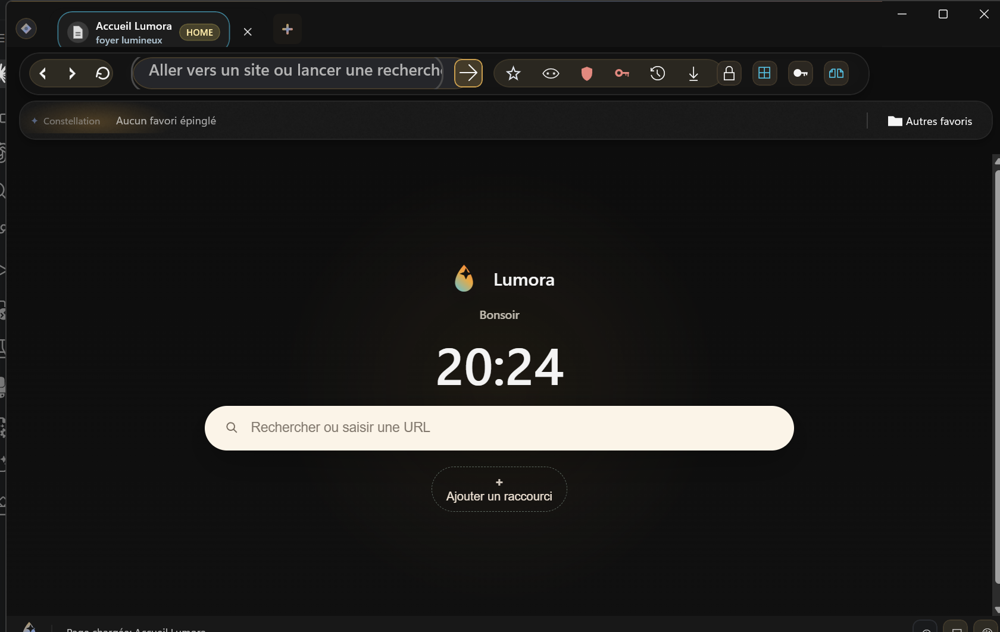
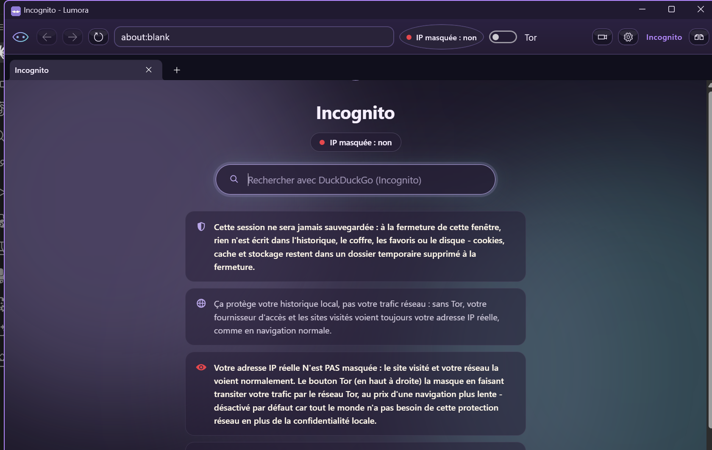
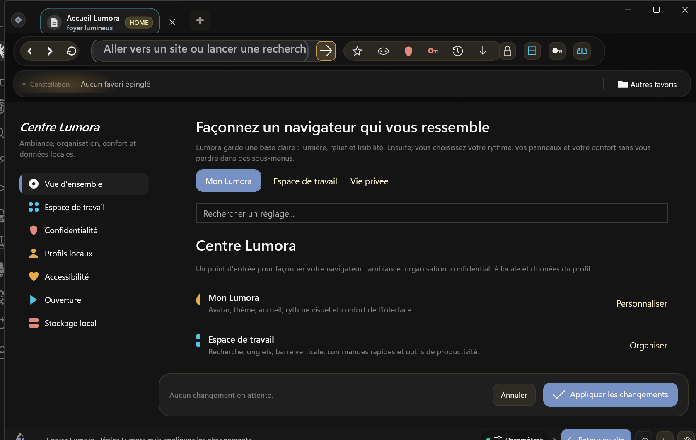
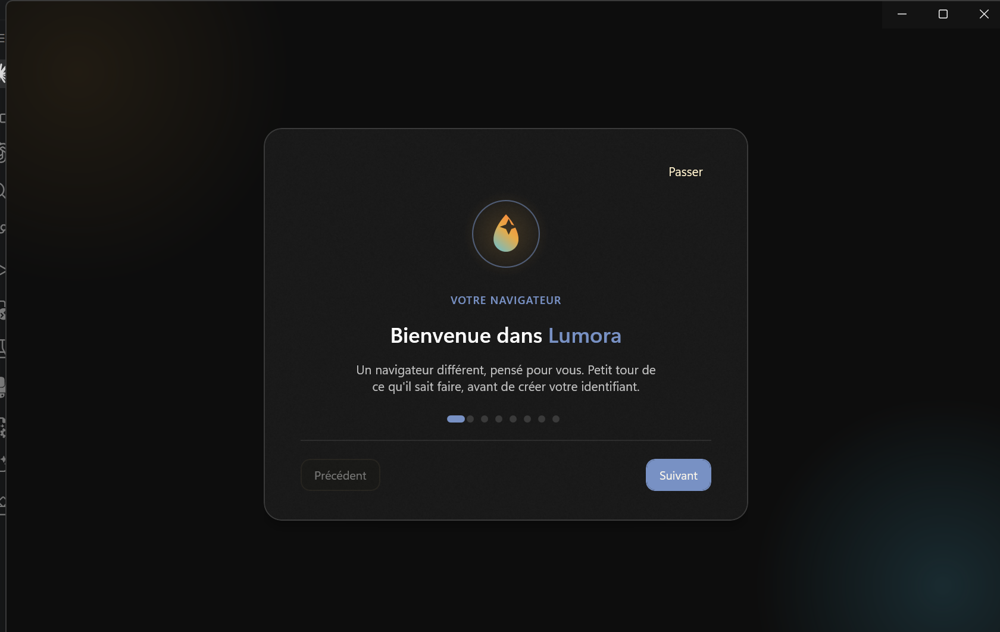

<div align="center">
  

  # Lumora

  *Un navigateur différent, pensé pour vous.*

  
  
  
</div>

> Lumora est en développement actif. Ce dépôt reflète l'état du code à
> l'instant présent, pas une version stable garantie.

La plupart des navigateurs traitent la confidentialité et l'accessibilité
comme des options : quelque part dans un menu, désactivées par défaut, à
découvrir soi-même. Lumora part du principe inverse — ce sont les réglages
de base, pas des extras qu'il faut aller chercher.

Concrètement : aucune donnée ne quitte votre machine. Pas de compte à
créer, pas de synchronisation vers un serveur, pas de télémétrie qui
remonte discrètement en arrière-plan. Mots de passe, favoris, historique
restent chez vous, chiffrés sur votre disque, nulle part ailleurs.

Ce n'est pas un navigateur « allégé » qui sacrifie le confort pour la
confidentialité. Lumora s'appuie sur le même moteur de rendu que les
navigateurs grand public (WebView2 / Chromium) : les sites s'affichent
normalement, la navigation reste rapide. La confidentialité est le point
de départ, pas le prix à payer — et l'accessibilité suit la même logique :
traitée au même niveau que le reste de l'interface, pas reléguée dans un
sous-menu.

Lumora est développé par une seule personne, **HandiJyhel**, et sert de
navigateur principal au quotidien.

## Ce que Lumora fait

- **Coffre local chiffré** — mots de passe, passkeys et codes
  d'authentification à deux facteurs (TOTP) regroupés au même endroit,
  chiffrés sur votre disque, jamais envoyés vers un service tiers.
- **Bloqueur de publicités et traqueurs** intégré et activé par défaut —
  pas une extension à installer, pas une case à trouver dans les réglages.
- **Profils locaux et vrai mode invité** — chaque profil protégé par mot
  de passe ou code PIN ; le mode invité ne laisse rien derrière lui à la
  fermeture.
- **Navigation privée et Tor en option** — une session Incognito qui
  n'écrit rien sur le disque, et pour qui en a besoin, un routage via Tor
  qui masque l'adresse IP, désactivé par défaut pour ne pas imposer sa
  lenteur à tout le monde.
- **Accessibilité de premier ordre** — aides à la lecture, loupe, lecture
  à voix haute, modes visuels pour la fatigue oculaire ou la basse vision,
  intégrés à l'interface plutôt que relégués dans un sous-menu.
- **Un navigateur qui se façonne** — thème, densité, disposition, mode
  d'usage : Lumora s'adapte à votre façon de travailler plutôt que
  l'inverse.
- **Sauvegarde et restauration complètes** du profil, et un installateur
  qui n'exige aucun prérequis système, pour changer de machine sans rien
  perdre.

## Aperçu

<table>
  <tr>
    <td align="center" width="50%">
      <br>
      <sub><b>Fenêtre principale</b></sub>
    </td>
    <td align="center" width="50%">
      <br>
      <sub><b>Navigation privée</b></sub>
    </td>
  </tr>
  <tr>
    <td align="center" width="50%">
      <br>
      <sub><b>Réglages</b></sub>
    </td>
    <td align="center" width="50%">
      <br>
      <sub><b>Premier lancement</b></sub>
    </td>
  </tr>
</table>

## Pile technique

- [.NET 8](https://dotnet.microsoft.com/) + [WinUI 3](https://learn.microsoft.com/windows/apps/winui/winui3/)
  pour l'interface.
- [Microsoft Edge WebView2](https://learn.microsoft.com/microsoft-edge/webview2/)
  (mode *Fixed Version* embarqué) comme moteur de rendu web.
- Application *self-contained* : aucun runtime .NET à installer au préalable
  sur la machine cible.

## Construire et lancer le projet

`dotnet build` échoue sur ce projet à cause du packaging PRI du Windows App
SDK (limitation connue du SDK .NET, pas du code) — utiliser MSBuild de
Visual Studio à la place :

```powershell
.\scripts\run-winui.ps1
```

Ce script compile en configuration Debug et lance l'application. Pour un
build de test isolé (sans toucher à votre profil Lumora existant), voir
`scripts\build-clean-test-artifact.ps1` puis `scripts\build-installer.ps1`.

### Tests

```powershell
cd Lumora.Tests
dotnet test
```

## Licence

Lumora est distribué sous licence **GNU GPLv3** (voir [`LICENSE`](LICENSE)),
avec une exception explicite autorisant la liaison avec WebView2 et le
Windows App SDK, tous deux nécessaires au fonctionnement sur Windows mais non
couverts par une licence libre — voir
[`LICENSE-EXCEPTIONS.md`](LICENSE-EXCEPTIONS.md) pour le détail.

## Auteur

Développé par **HandiJyhel**.

---

<div align="center">

*Bonne navigation, et bienvenue dans un monde simple et protégé.*

**— HandiJyhel**

</div>
